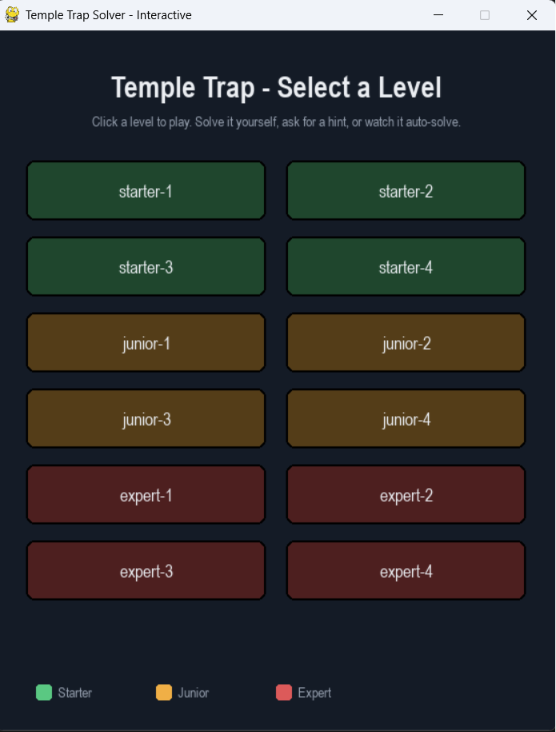
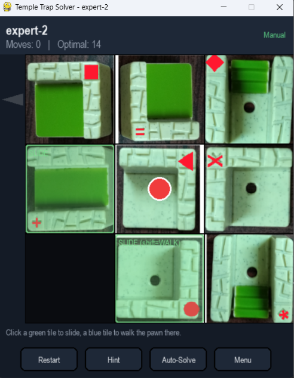
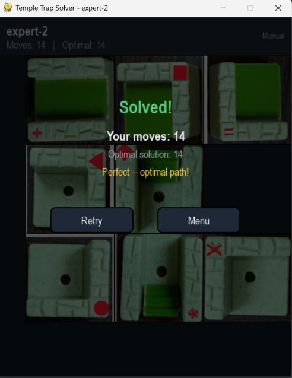

# 🏛️ Temple Trap Solver

An interactive Python implementation of the **Temple Trap** sliding-block puzzle featuring an optimal **A\* Search** solver and a **Pygame-based GUI**. Players can solve puzzles manually, request optimal hints, or watch the algorithm automatically compute and replay the shortest solution.

---

## 📸 Screenshots

### Level Selection



### Gameplay



### Solution Screen



---

## 🎯 What is Temple Trap?

Temple Trap is a **3 × 3 sliding-block puzzle** where the objective is to guide an explorer out of an ancient temple by strategically **sliding tiles** and **moving the pawn** through connected pathways.

Unlike a traditional sliding puzzle, Temple Trap introduces several unique mechanics:

- Two movement layers (**Ground** and **Top**)
- Stair tiles that allow movement between floors
- Rotatable pathway tiles with different connectivity
- A lock rule that prevents sliding the tile currently occupied by the pawn

The challenge is to determine the **minimum-cost sequence** of tile slides and pawn movements required to reach the exit.

---

## 🎮 Game Mechanics

Each move consists of one of two actions.

### Slide

Move an adjacent tile into the empty position.

- Cost = 1
- The pawn's current tile cannot be moved (Lock Rule).

### Walk

Move the pawn across connected pathways.

- Cost = 1 per movement
- Movement is only allowed through connected tile openings.
- Stair tiles allow movement between the Ground and Top floors.
- The blank cell cannot be entered.

The puzzle is solved when the pawn reaches the exit on the left side of the board.

---

## ✨ Features

- Interactive Pygame graphical interface
- A* Search algorithm for optimal solutions
- Manual puzzle solving
- Hint generation based on the optimal solution
- Auto-solve animation
- Multiple difficulty levels (Starter, Junior, Expert)
- Real-time move counter with optimal solution comparison
- Interactive level selection menu
- Restart and replay support

---

## 🛠️ Tech Stack

- Python 3
- Pygame
- A* Search
- Breadth-First Search (BFS)

---

## 🚀 Installation

Clone the repository:

```bash
git clone https://github.com/sujeeth-kumar/temple-trap-solver.git
cd temple-trap-solver
```

Install the required packages:

```bash
pip install -r requirements.txt
```

Run the application:

```bash
python main.py
```

Launch a specific level directly:

```bash
python main.py junior-2
```

---

## ⌨️ Controls

| Action | Control |
|---------|---------|
| Move Pawn | Click highlighted blue cell |
| Slide Tile | Click highlighted green tile |
| Hint | **H** |
| Auto Solve | **A** |
| Restart Level | **R** |
| Exit Temple | **E** |
| Return to Menu | **Esc** |

---

## 🔍 Search Algorithm

The puzzle is modeled as a **state-space search problem** and solved using the **A\*** Search algorithm.

Each search state consists of:

- Current board configuration
- Tile orientations
- Pawn position
- Current floor (Ground / Top)

The solver generates every valid slide and walk action from the current state and explores the state space using:

**f(n) = g(n) + h(n)**

where:

- **g(n)** is the total cost accumulated so far.
- **h(n)** estimates the remaining cost to reach the exit.

Using an admissible heuristic allows A* to efficiently compute an **optimal solution** while minimizing unnecessary exploration.

---

## 📁 Project Structure

```text
temple-trap-solver/
│
├── documents/
│   └── templetrap_details.pdf
│
├── screenshots/
│   ├── level-selection.png
│   ├── gameplay.png
│   └── solved.png
│
├── temple_trap/
│   ├── assets/
│   ├── __init__.py
│   ├── config.py
│   ├── engine.py
│   ├── solver.py
│   └── visualizer.py
│
├── .gitignore
├── main.py
├── README.md
└── requirements.txt
```

---

## 📄 Documentation

The repository includes a detailed project report describing:

- Puzzle formulation
- State-space representation
- Action space
- Movement rules
- Cost function
- Goal state
- Example puzzle solutions

📄 **[Temple Trap Project Documentation](documents/templetrap_details.pdf)**

---

## 🚀 Future Improvements

- Support additional search algorithms (IDA*, Bidirectional Search)
- Random puzzle generation
- Custom level editor
- Performance benchmarking
- Undo/Redo functionality
- Save and load game progress

---

## 👨‍💻 Author

**Sujeeth Kumar**

Developed as part of the *Introduction to Artificial Intelligence* coursework.
